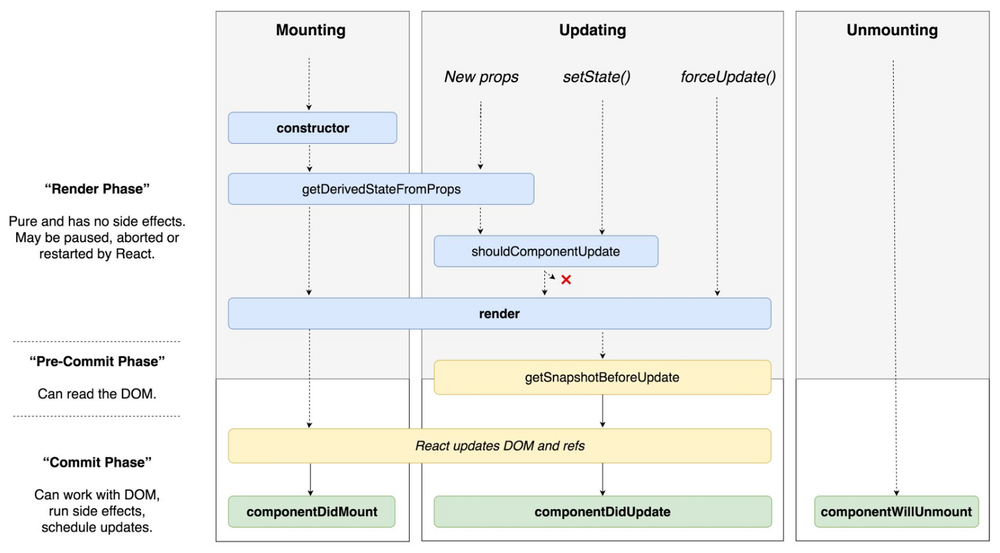

1. 生命周期
   
   

2. 生命周期只在状态组件中才会有，在typescript 只是简单类的实例，在开始过成功不要使用这些函数作为其他公共方法。
3. componentDidMount:
   
+ 获取数据服务

    和vue 响应式不一样，react 会先执行render ，在componentDidMount 执行前，render中的state 都是初始值，

    在DidMount 之前获取之前获取数据，如果返回数据较晚，会出现得不到值的情况，而 DidMount DOM 元素已挂载。
+ 初始化事件
+ timers

4. componentWillUnMount 移除是触发

+ 移除事件监听
+ 移除timers
+ 取消网络请求

5. getDerivedStateFromProps(props,state)