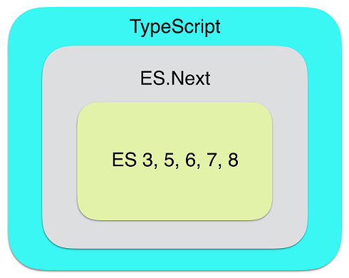
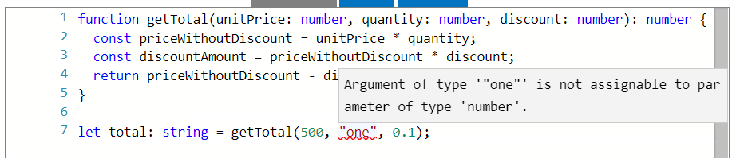
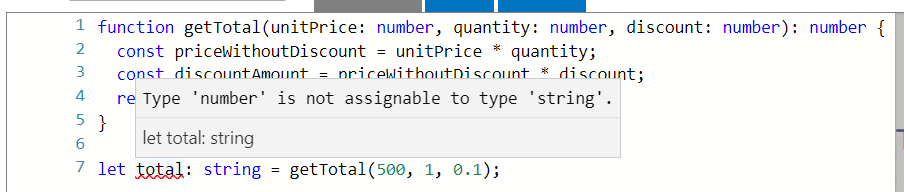
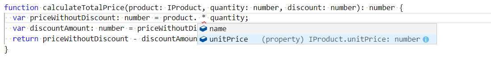

1. typescript 是JavaScript的一个超集，包含es5~es2019 ，最终编译成浏览器支持的javascript

图1.1说明了TypeScript作为ECMAScript的超集，它是所有JavaScript版本的规范。ES.Next代表了ECMAScript的最新添加，仍在进行中。

   
1. typescript 文件后缀名.ts
   
2. typescript 支持强类型，变量给定类型以后，在赋值时只能使用同类型的值，比如：
   
+ 变量类型验证

        let a:number=123;
        a=33;
        // 以上a被赋值为number 类型，以后赋值时只能是number 类型的值，不然报错
        a='33';

        error TS2322: Type '"33"' is not assignable to type 'number'.

+ 函数参数验证

 

+ 函数返回值类型验证
  
  
        
1. typescript 中变量必须要先声明才能使用。

2. 创建TypeScript是为了向JavaScript添加静态类型检查。将本来是运行时错误的错误转换为编译错误，尤其是在大型应用程序中，会使代码更易于维护和恢复 
3. 好处：
   + 可以在开发过程中更早地发现编码错误
   + 编辑器提示
  
   
   + 